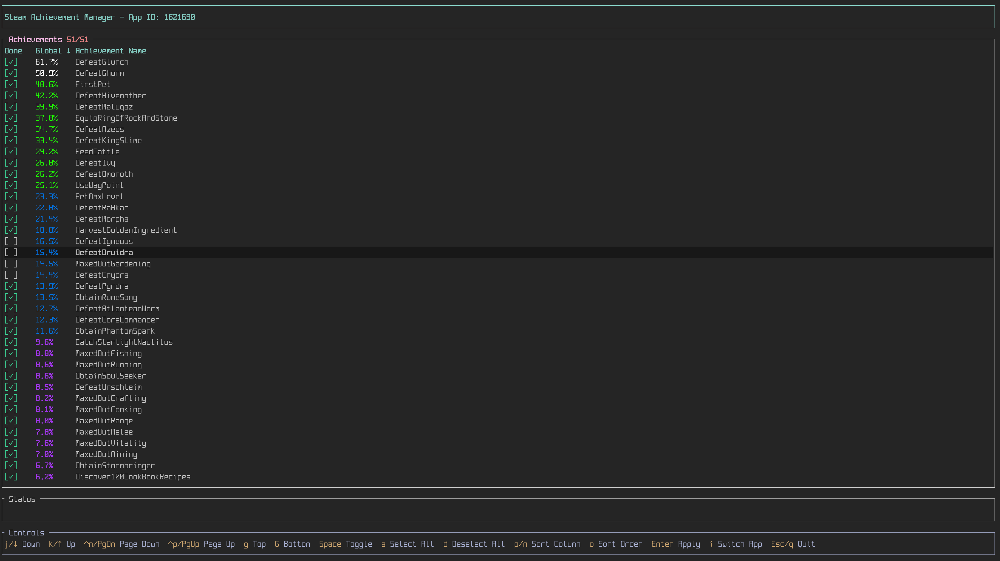

# Steam Achievement Manager

A terminal-based tool for unlocking or resetting Steam achievements for any game in your library. Built with Rust for cross-platform compatibility.



## Features

- Interactive TUI (Terminal User Interface) for easy achievement management
- Unlock or reset achievements individually or in bulk
- Cross-platform support: Windows, Linux, and macOS (including Apple Silicon)
- Fast and lightweight

## Requirements

- Steam must be running and logged in
- The game must be in your Steam library

## Installation

### Pre-built Releases

1. Download the latest release for your platform from the [releases page](https://github.com/mbwilding/steam-achievement-manager/releases)
2. Extract the relevant archive

#### Windows

```powershell
sam
```

#### macOS / Linux

```bash
chmod +x sam
./sam
```

### Build from Source

```bash
git clone --depth=1 https://github.com/mbwilding/steam-achievement-manager
cd steam-achievement-manager
cargo build --release
```

## Usage

### Interactive Mode (Recommended)

Launch the TUI and you'll be prompted to enter a Steam App ID:

```bash
sam
```

### Direct Launch

Skip the App ID prompt by providing it directly:

```bash
sam --id 480
```

### Finding Steam App IDs

You can find a game's App ID by:
- Right-clicking the game in your Steam library, selecting `Properties > Updates` and looking for `App ID`
- Searching for the game on [SteamDB](https://steamdb.info/) and checking the `App ID` listed on the game's page

## Controls

Once in the achievement manager:

| Key | Action |
|-----|--------|
| `↑` / `k` | Move up |
| `↓` / `j` | Move down |
| `Space` | Toggle achievement selection |
| `a` | Select all achievements |
| `d` | Deselect all achievements |
| `Enter` | Process changes (unlock/reset selected achievements) |
| `q` / `Esc` | Quit |

## How It Works

The tool uses the [Steamworks](https://partner.steamgames.com/doc/sdk) API to interact with Steam's achievement system. When you process changes:

- **Unlocking**: Selected achievements that are currently locked will be unlocked
- **Resetting**: Deselected achievements that are currently unlocked will be reset

## License

See [LICENSE](LICENSE) file for details.

## Contributing

Contributions are welcome! Please feel free to submit a Pull Request.

## Disclaimer

This tool modifies Steam achievement data. Use at your own risk. The authors are not responsible for any consequences that may result from using this tool, including but not limited to Steam account restrictions.
